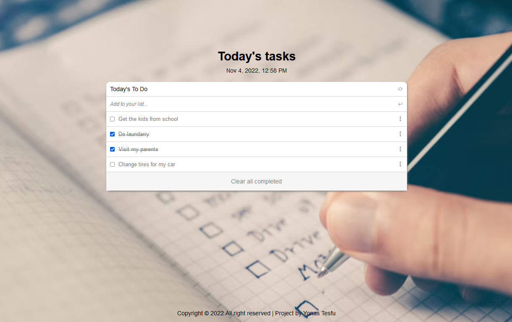

A todo-list project built with Webpack and ES6 modules

# Project Name

> To-Do List

## Built With

- Major languages : HTML, CSS & JavaScript
- Frameworks : Bootstrap

## Getting Started

In this project I built a simple HTML list of To Do tasks using webpack and served by a webpack dev server along with ES6 modules.

- The webpage will allow users to add lists easily using the input field.
- The completed tasks will each have a line through, implying the task is complete.
- The completed tasks can be removed all together using a button.

### Setup

Run git clone https://github.com/yonas44/Todo-list_webpack.git
Run cd Todo-list_webpack.git
Run npm install
Run npm start

## Authors

👤 **Author1**

- GitHub: [@yonas44](git@github.com:yonas44/Todo-list_webpack.git)

## 🤝 Contributing

Contributions, issues, and feature requests are welcome!

Feel free to check the [issues page](../../issues/).

## Show your support

Give a ⭐️ if you like this project!

## Acknowledgments

- Hat tip to anyone whose code was used
- Inspiration
- etc

## 📝 License

This project is [MIT](./MIT.md) licensed.

_NOTE: we recommend using the
[MIT license](https://choosealicense.com/licenses/mit/) - you can set it up
quickly by
[using templates available on GitHub](https://docs.github.com/en/communities/setting-up-your-project-for-healthy-contributions/adding-a-license-to-a-repository).
You can also use [any other license](https://choosealicense.com/licenses/) if
you wish._
